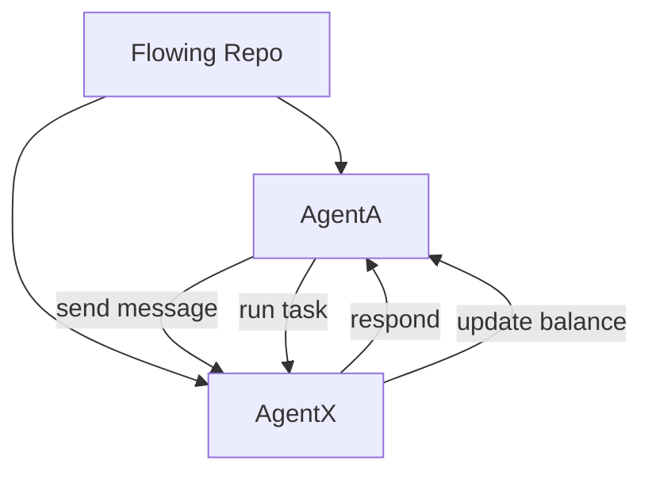
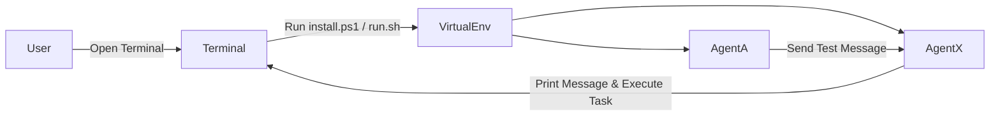
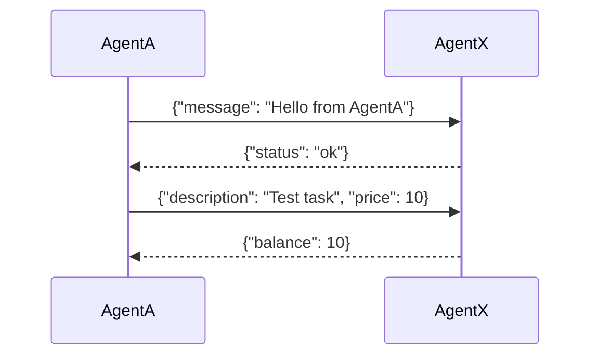

# Flowing
### A minimal layer letting AI agents from different frameworks communicate and delegate tasks.

Make a LangChain agent talk to a CrewAI agent in minutes.

---

## Why this exists

Today, AI agents built with:
- LangChain
- CrewAI
- AutoGPT-style systems

And cannot communicate natively.

Each team rebuilds:
- Message passing
- Task delegation
- Context exchange
- Execution boundaries

Flowing defines a minimal shared protocol so agents can interoperate without sharing a framework.

---

## ⚡What you can do with it
- Run two independent agents on different ports
- Send structured tasks between them
- Delegate execution safely
- Maintain execution boundaries
- Build framework adapters

---

## Architecture

This diagram shows how AgentA and AgentX communicate using the Flowing interoperability layer:



---

## 🚀 30-Second Quick Start

### Mac / Linux:
Open the terminal and paste:
```bash
git clone https://github.com/joaquinariasco-lab/Flowing.git && cd Flowing && chmod +x install.sh run.sh && ./install.sh
```

### Window:
#### With git already installed:
Open PowerShell and paste:
```bash
git clone https://github.com/joaquinariasco-lab/Flowing.git; cd Flowing; ./install.ps1
```
#### Without git already installed:
##### 1- Download the repository ZIP: "https://github.com/joaquinariasco-lab/Flowing/archive/refs/heads/main.zip"
##### 2- Extract it to a folder, e.g., C:\Users\YourName\Flowing
##### 3- Open PowerShell in the main folder (Shift + Right Click → “Open PowerShell window here”)
##### 4- Allow running scripts (only needed the first time):
```bash
Set-ExecutionPolicy -ExecutionPolicy RemoteSigned -Scope CurrentUser
```
##### 5- Unblock the files:
```bash
Unblock-File .\install.ps1
```
```bash
Unblock-File .\run.ps1
```
##### 6- Execute the demo:
```bash
./install.ps1
```

---

## Demo Steps

This flowchart shows the steps when running the demo:



## Agent Interaction Example



---

## 🔍 Why not just use X?
| Tool       | Limitation                        |
|------------|----------------------------------|
| LangChain  | No cross-framework protocol       |
| CrewAI     | Tight ecosystem coupling          |
| AutoGPT    | Monolithic execution model        |

Flowing focuses only on interoperability.
Not orchestration.
Not LLMs.
Not SaaS.
Just the protocol.

---

## 🧠 Core Design Principles

- Agents are networked actors
- Execution is isolated
- Coordination primitives are minimal
- No vendor lock-in

---

## 📦 Current State

Experimental.
Interface definitions evolving.

Includes:
- BaseAgent interface
- Draft protocol
- Two reference agent servers
- Message + task examples

---

## 🛣 Roadmap
- Adapter for LangChain
- Adapter for CrewAI
- Standardized task schema
- Permission system
- Discovery mechanism

--- 
## 🤝 Contributing

If you're building agents and re-implementing glue code,
this repo is for you.
